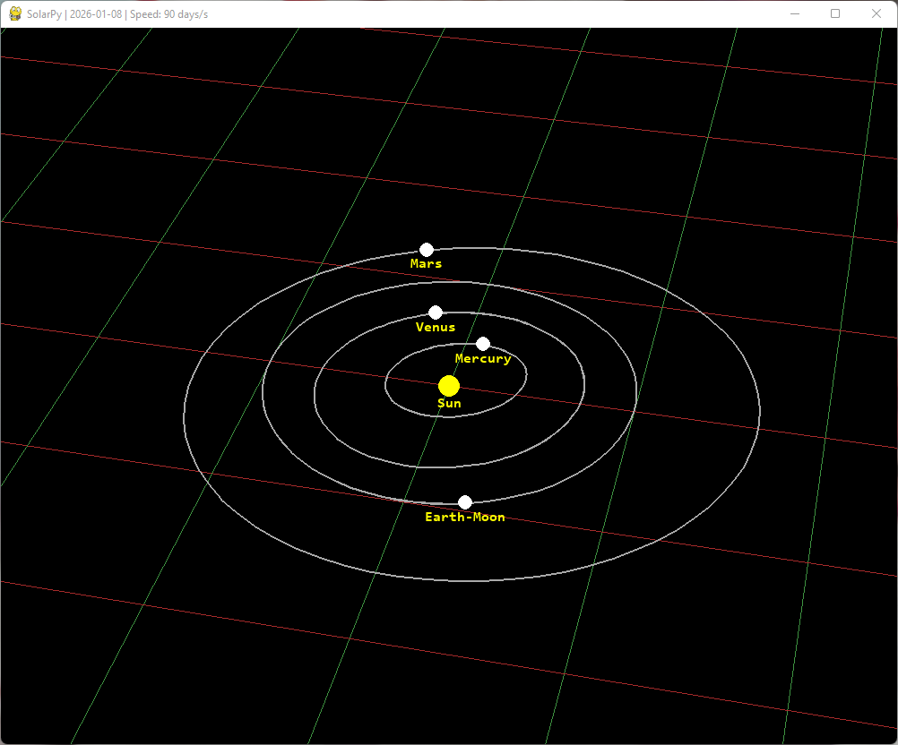
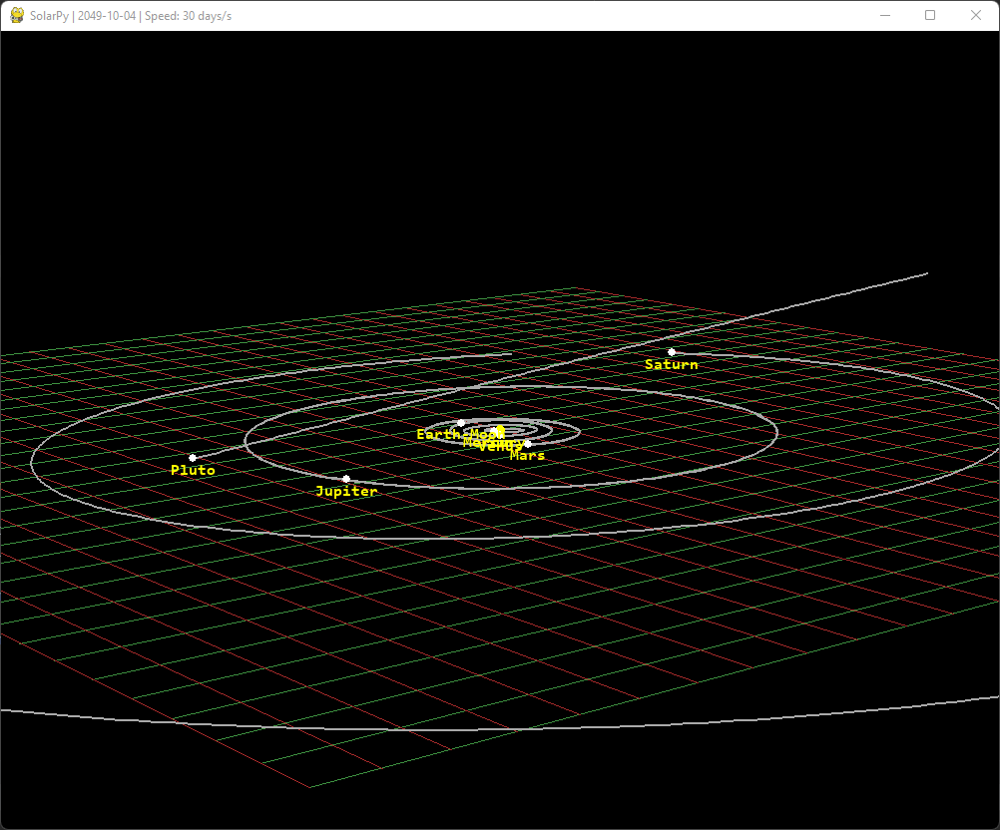

# SolarPy: 3D Solar System Simulation

<p float="left" align="middle">
  
  
</p>

This project is a fairly accurate simulation of the Solar system in 3D. The initial positions
are calculated using desired date and orbital elements of planets. Once ready, the simulation proceeds
by using the general second order ordinary differential equation system of planetary motion, which we solve
numerically using Runge-Kutta method.

## Required modules

* NumPy
* Pygame

Optional: [astroquery](https://astroquery.readthedocs.io/en/latest/) 
& [astropy](https://www.astropy.org/) (to use data from JPL Horizons instead of generating out own)

## Running the simulation

Simply run `main.py` to start the simulation with default parameters: the 
start date will be set to the current date, and the program won't use 
JPL Horizons Queries to determine initial state.

The program can be run with additional command line arguments:
* `--start=<date>` Start simulation from date specified in YYYY-MM-DD format. For example:
    ```
    python main.py --start=1500-01-01
    ```
* `--dt=<delta>` Set the dt used in simulation in hours (default is 24h)
    ```
    python main.py  --start=2000-01-01 --dt=8
    ```
* `--horizons` Use JPL Horizons Queries to calculate initial state (can be combined with `--start`).
    ```
    python main.py --horizons
    ```

## Controlling the simulation

* Press `SPACE` to pause/unpause the simulation
* Drag the mouse to move the camera, scroll to zoom
* Scroll while holding the right mouse button to change simulation speed
* Press `p` in order to dump current positions and velocities of planets into a file in the `output` folder

## References

* [Approximate Positions of the Planets (ssd.jpl.nasa.gov)](https://ssd.jpl.nasa.gov/planets/approx_pos.html)
* [CHAPTER 8 : Orbital Ephemerides of the Sun , Moon , and Planets.](http://vadimchazov.narod.ru/text_pdf/XSChap8.pdf)
  E. Standish, James G. Williams
* [Keplerian Orbit Elements → Cartesian State Vectors.](https://downloads.rene-schwarz.com/download/M001-Keplerian_Orbit_Elements_to_Cartesian_State_Vectors.pdf)
  René Schwarz
* [THE EQUATIONS OF PLANETARY MOTION AND THEIR NUMERICAL SOLUTION.](http://www.wiu.edu/cas/mathematics_and_philosophy/graduate/equations-planetary-motion.pdf#section.5)
  Jonathan Njeunje, Dinuka Sewwandi de Silva
* [opengl-tutorial (www.opengl-tutorial.org)](http://www.opengl-tutorial.org/beginners-tutorials/tutorial-3-matrices/)
* [Perspective Projection - Graphics Programming.](https://www.mathematik.uni-marburg.de/~thormae/lectures/graphics1/graphics_6_1_eng_web.html#1)
  Thorsten Thormählen.
